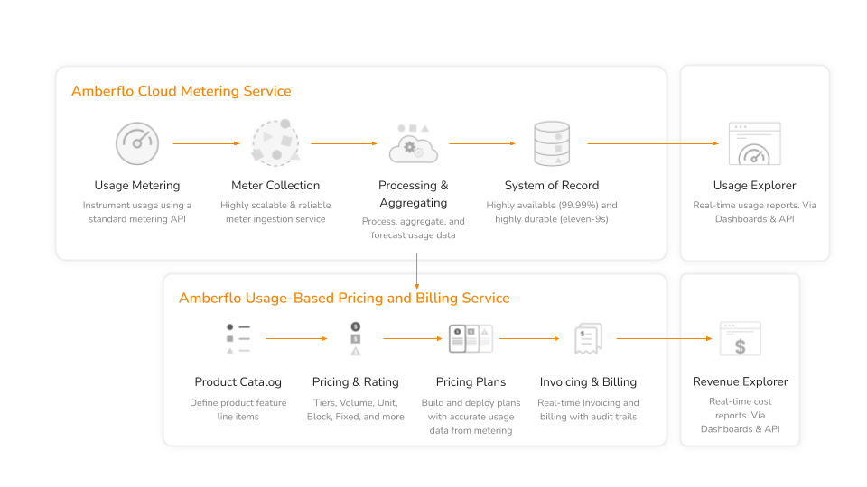

# Amberflo Metering for AWS SBT

### Overview

This module extends the AWS SaaS Builder ToolKit (SBT) by integrating Amberflo’s cloud native solution, enabling seamless metering, pricing, and billing of your customers' (tenants’) usage. With this integration, you can effortlessly implement a modern, usage-based billing for your SaaS and GenAI applications out-of-the-box.

[AWS SaaS Builder Toolkit (SBT)](https://github.com/awslabs/sbt-aws) is an open-source developer toolkit to implement SaaS best practices. SBT attempts to codify several control plane and application plane concepts such as tenant and user management, billing, and onboarding into reusable components, promoting reuse and reducing boilerplate code.


This repository provides a detailed implementation of the Amberflo metering service for use with the AWS SaaS Factory Software Builder Toolkit (SBT). The implementation enables Independent Software Vendors (ISVs) to integrate Amberflo with their SBT-based applications, allowing for accurate and efficient metering and usage tracking.


### What is Amberflo

[Amberflo](https://docs.amberflo.io/docs/what-is-amberflo) is a cloud-based platform designed to help businesses implement and manage metering, usage-based billing, and analytics for their SaaS (Software as a Service) products and services. 

Amberflo offers a robust platform for real-time tracking, metering and billing of usage events such as LLM tokens, API transactions, and consumption of compute, storage, and network resources, enabling precise billing based on actual usage. Whether you’re managing a subscription-based business model or billing customers per unique user, Amberflo’s billing cloud streamlines the invoicing process and integrates seamlessly with popular payment gateways like Stripe or ERP systems like Netsuite, ensuring smooth, automated customer invoicing and payment collection.

<p align="center">
  
</p>

With Amberflo, you can:
- Create and manage meters for tracking usage
- Ingest usage events in real-time
- Fetch usage data for billing and analytics
- Cancel usage events for incorrect or duplicate entries

### How does Amberflo work with SBT?

The Amberflo metering implementation provided in this repository allows ISVs to integrate Amberflo with their SBT-based applications. This enables ISVs to:
- Track and analyze usage metrics for their tenants
- Create a more accurate and efficient billing process

The `AmberfloMetering` construct deploys an AWS Lambda function to handle usage metering. 
It also provides a set of APIs for creating and updating meters, fetching usage, as well as ingesting usage events and canceling usage events. 
SaaS admins can use these endpoints for managing the application metering.

The following endpoints are created in the control plane
- Create Meter: POST /meters
- Update Meter: PUT /meters/{meterId}
- Ingest Usage: POST /ingest
- Cancel Usage: DELETE /usage
- Fetch Usage: GET /usage/meterId

Here's a brief overview of how this works:

- **Meter Creation**: SaaS admins can create meters through the create meter API in control plane or through the Amberflo UI.
- **Event Emission**: Your application or service emits an [ingest usage](https://github.com/awslabs/sbt-aws/blob/main/src/utils/event-manager.ts#L110) event with the necessary details to measure usage for a specific meter.
- **Lambda Invocation**: The `ingestUsageEventFunction` of `AmberfloMetering` is invoked automatically upon receiving the event.
- **Data Processing**: The Lambda function processes the event data and sends it to Amberflo for recording and subsequent usage analysis.
- **Fetch Usage**: SaaS admins can fetch usage through the fetch usage API in control plane or through the Amberflo UI.

## How to Use

### Prerequisites

1. **Deploy a SBT Project**: If you don't already have a SBT project deployed, follow [AWS SBT's tutorial](https://github.com/awslabs/sbt-aws/tree/main/docs/public) to deploy the sample `hello-cdk` project with a `ControlPlane` and `CoreApplicationPlane`.
2. **Amberflo Account**: You need an Amberflo account for this project. If you don’t have an Amberflo account, you can sign up for one here: [Amberflo Signup](https://www.amberflo.io/aws-saas-factory).
3. **API Key Secret**: After signing up, the Amberflo API Key must be stored as a secret in AWS Secrets Manager.
   
   - Secret Name: The name of the secret in AWS Secrets Manager.
   - Secret KeyId: The key within the secret JSON that identifies the Amberflo API Key.

   e.g. you have a secret named AmberfloApiKey in AWS Secrets manager with the following json

   ```json lines
   {"apiKey": "<api key from your amberflo account>"} 
   ```
   Pass the `AmberfloApiKey` to amberfloAPIKeySecretName and `apiKey` to amberfloAPIKeySecretId

   
### 1. Install the NPM Package

Within your SBT project directory, install `aws-sbt-amberflo` via the following command:

```shell
npm install --save sbt-aws-amberflo
```

### 2. Add AmberfloMetering to Your Control Plane
Instantiate the AmberfloMetering construct in your AWS CDK stack. Here’s an example TypeScript code snippet:

```typescript
import { Stack } from 'aws-cdk-lib';
import { Construct } from 'constructs';
import * as sbt from '@cdklabs/sbt-aws';
import { AmberfloMetering } from 'sbt-aws-amberflo';

export class ControlPlaneStack extends Stack {
  constructor(scope: Construct, id: string, props: any) {
    super(scope, id, props);

    const amberfloMetering = new AmberfloMetering(this, 'AmberfloMetering', {
      amberfloAPIKeySecretName: 'YourSecretName', 
      amberfloAPIKeySecretId: 'YourSecretKeyId', 
    });

    const controlPlane = new sbt.ControlPlane(this, 'ControlPlane', {
      metering: amberfloMetering,
    });
  }
}
```

#### Amberflo Metering Properties

| Property Name | Type | Required | Description                                                     | Default Value |
|:-------------|:-----|:---------|:----------------------------------------------------------------|:--------------|
| amberfloAPIKeySecretName | string | Yes      | The name of the AWS Secrets Manager secret.                     |  |
| amberfloAPIKeySecretId | string | Yes      | The key within the secret that identifies the Amberflo API Key. |  |
| amberfloBaseUrl | string | Optional | The base URL for Amberflo's API.                                | https://app.amberflo.io |

### 3. Provision a Meter
Once you deploy your updated stack, you can create and manage meters using the provided API endpoints. Here’s how you can create a meter:

```bash
METER=$(jq --null-input \
'{
  "label": "SBT Meter",
  "meterApiName": "sbt-meter",
  "meterType": "sum_of_all_usage"
}')

echo "creating meter..."
curl --request POST \
    --url "${CONTROL_PLANE_API_ENDPOINT}meters" \
    --header "Authorization: Bearer ${ACCESS_TOKEN}" \
    --header 'content-type: application/json' \
    --data "$METER" | jq
```

The above 3 properties are the required properties for creating a meter. You can also pass in additional properties while creating a meter. See more on [creating meters](https://docs.amberflo.io/reference/create-a-meter) in Amberflo.

### 4. Update a Meter
Once you deploy your updated stack, you can update meters using the provided API endpoint. Here’s how you can update a meter:

```bash
UPDATE_METER=$(jq --null-input \
'{
  "label": "SBT trial meter",
  "meterApiName": "sbt-trial",
  "meterType": "sum_of_all_usage"
}')

echo "updating meter..."
curl --request PUT \
    --url "${CONTROL_PLANE_API_ENDPOINT}meters/<meter-id>" \
    --header "Authorization: Bearer ${ACCESS_TOKEN}" \
    --header 'content-type: application/json' \
    --data "$UPDATE_METER" | jq
```

### 5. Get a Meter
You can get a meter by id using the provided API endpoint. Here’s how you can get a meter:

```bash
curl --request GET \
    --url "${CONTROL_PLANE_API_ENDPOINT}meters/<meterId>" \
    --header "Authorization: Bearer ${ACCESS_TOKEN}" \
    --silent | jq
```

### 6. List all Meters
You can list all meters using the provided API endpoint. Here’s how you can list all meter:

```bash
curl --request GET \
    --url "${CONTROL_PLANE_API_ENDPOINT}meters/<meterId>" \
    --header "Authorization: Bearer ${ACCESS_TOKEN}" \
    --silent | jq
```

### 7. Delete a Meter
You can delete a meter by id using the provided API endpoint. Here’s how you can delete a meter:

```bash
curl --request DELETE \
    --url "${CONTROL_PLANE_API_ENDPOINT}meters/<meterId>" \
    --header "Authorization: Bearer ${ACCESS_TOKEN}" \
    --silent | jq
```

### 8. Ingest Usage Events
To ingest usage events, application or service in the application plane must emit events that represent usage metrics, which will be processed by the ingestUsageEventFunction Lambda function.

Event details must contain the following required properties:
- tenantId: The identifier of the tenant to associate with the usage.
- meterApiName: The name of the meter as used in the createMeter.
- meterValue: The quantity or amount of usage to record for a tenant.

These properties are necessary to accurately track and attribute usage metrics.
You can also pass in additional values for dimensions, if the meter has dimensions defined.

Example

```typescript
const putEventsResponse = eventManager.eventBus.putEvents({
  entries: [{
    detail: {
      "tenantId": <tenantId>,
      "meterApiName": <meterApiName as used in create meter>,
      "meterValue": <usage value that is to be recorded>
    },
    detailType: DetailType.INGEST_USAGE,
    source: eventManager.applicationPlaneEventSource,
  }],
});
```
The ingestUsageEventFunction Lambda function will be triggered to handle this event and send the data to Amberflo for processing.

Note: the eventManager is the eventManager passed to the [CoreApplicationPlane](https://github.com/awslabs/sbt-aws/blob/main/src/core-app-plane/core-app-plane.ts#L15)

### 9. Fetch Usage Data
To fetch usage data, use the API endpoint to retrieve data based on your meter API name:

Example

```bash
METER_API_NAME = 'sbt-meter'
START_TIME = 1724630400
END_TIME = 1724716800

curl --request GET \
    --url "${CONTROL_PLANE_API_ENDPOINT}usage/<meterId>?meterApiName=${METER_API_NAME}&startTimeInSeconds=${START_TIME}&endTimeInSeconds=${END_TIME}" \
    --header "Authorization: Bearer ${ACCESS_TOKEN}" \
    --silent | jq
```

The meterApiName id not provided in the query string will be fetched using the meterId path parameter. 
The startTimeInSeconds and endTimeInSeconds are optional and default to (current time - 24hrs) and current time.

### 10. Cancelling incorrect usage events

There are occasions where a meter event source may send or report incorrect or erroneous meters. Amberflo provides the ability to cancel (undo) one or more meter events as needed.
See detailed [guide](https://docs.amberflo.io/docs/meter-events-cancellation) on canceling usage events.

Example

```bash
FILTER=$(jq --null-input \
'{
  "id": "sbt-filtering-rule",
  "meterApiName": "sbt-trial",
  "ingestionTimeRange": {
    "startTimeInSeconds": 1724367600,
    "endTimeInSeconds": 1724371200
  }
}')

echo "creating filtering rule for canceling usage events..."
curl --request DELETE \
    --url "${CONTROL_PLANE_API_ENDPOINT}usage" \
    --header "Authorization: Bearer ${ACCESS_TOKEN}" \
    --header 'content-type: application/json' \
    --data "$FILTER" | jq
```

The id, meterApiName and ingestionTimeRange are required parameters.

The above command creates a filtering rule that cancels the events for the meter `sbt-trial` in the given time range. You can also cancel more specific events for specific tenant or based on specific dimensions etc.
See the [Amberflo API](https://docs.amberflo.io/reference/create-or-update-a-filtering-rule) for more details.


